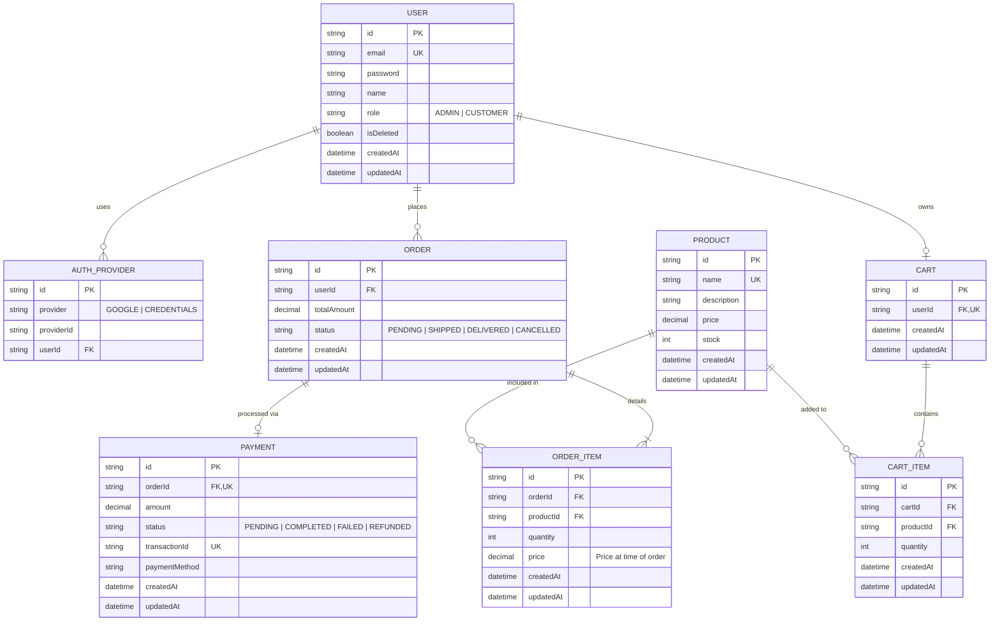

# Entity Relationship Diagram (ERD)

This diagram illustrates the database schema and relationships for the Mini-Ecommerce system.

## Key Relationships
- **User & Auth**: A user can have multiple authentication methods (Credentials, Google, etc.).
- **User & Cart**: Each user has one active cart.
- **Order & Product**: Products are linked to orders via `OrderItem`, which captures the price at the moment of purchase to protect against future price changes.
- **Order & Payment**: Every order can have at most one payment attempt (successful or pending).
