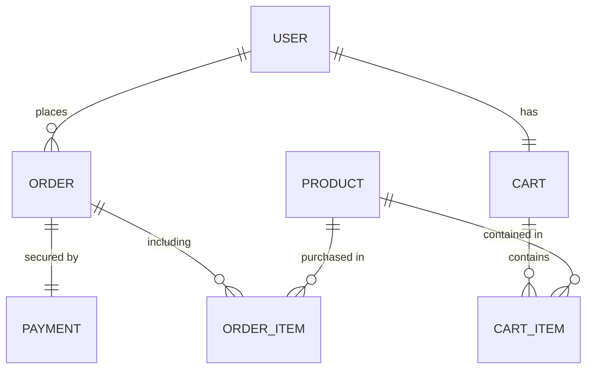

# Mini E-Commerce API - AppifyDevs Backend Assignment

A robust, enterprise-grade backend for a mini e-commerce platform. This project focuses on high-integrity order processing, secure payment integration, and advanced fraud prevention mechanisms to protect business operations.

## 🚀 Tech Stack

- **Runtime**: Node.js
- **Framework**: Express.js
- **Language**: TypeScript
- **Database**: PostgreSQL
- **ORM**: Prisma
- **Authentication**: JWT & Passport roles (RBAC)
- **Payment**: Stripe Checkout & Webhooks
- **Validation**: Zod
- **Environment**: envalid

---

## 🛡️ Key Architectural Decisions & Fraud Prevention

### 1. Robust Stock Integrity (Anti-Race Condition)
To prevent overselling under high concurrent load, the system uses **Pessimistic Row Locking (`SELECT ... FOR UPDATE`)**. When an order is being calculated, the exact product rows are locked in the database. This ensures that stock validation remains accurate even if 100 users try to buy the last item at the exact same millisecond.

### 2. Multi-Layer Fraud Prevention
The system implements strict guards against the **"Stock Misuse"** risks mentioned in the requirements:
- **Pending Order Cap**: Each user is restricted to a maximum of **5 concurrent PENDING orders**. This prevents malicious actors from "jailing" inventory by creating thousands of unpaid orders.
- **Daily Cancellation Limit**: Customers are restricted to **3 cancellations per day**. This prevents automated harassment of inventory (repeatedly creation and cancellation cycles).
- **Ownership Verification**: Strict ownership checks ensure users can only access or modify their own orders/carts.
- **Payment Guard**: Once an order is paid, the customer can no longer cancel it (requires Admin intervention), ensuring fulfillment security.

### 3. Advanced Rate Limiting (DOS & Brute-Force Protection)
The system leverages `express-rate-limit` to provide granular security at the network layer:
- **Auth Guard**: Limits login and registration attempts to **5 per 15 minutes** (on failures), protecting accounts from brute-force password attacks.
- **Checkout Guard**: Limits order creation and payment initiation to **10 per hour**, preventing automated "inventory jailing" or checkout spam.
- **Global API Limit**: A general cap of **100 requests per 15 minutes** across all endpoints to ensure service availability for all users.

### 4. Non-Blocking Payment Flow
The payment integration follows the **"Commit-First, Process-Later"** pattern.
1. The database transaction stores the Order and deducts stock first.
2. The Stripe Checkout Session is initiated *after* the transaction commits.
3. This prevents long-running external API calls from "hanging" database connections, allowing the system to scale efficiently.

### 4. Automated Inventory Recovery (Cron Job)
The system includes a professional **Background Worker** (`node-cron`) that automatically manages the business lifecycle of an order:
- **Expiry Logic**: Any `PENDING` order that remains unpaid for more than **30 minutes** is automatically marked as `CANCELLED`.
- **Stock Restoration**: The worker atomically restores the reserved product quantities back to the inventory catalog, ensuring that stock is never "locked" by inactive users.

### 5. Secure Webhook Implementation
The payment confirmation logic is protected by **Signature Verification**. Only cryptographically signed events from Stripe are accepted. Furthermore, the handler is **Idempotent**, ensuring that if Stripe sends the same event twice, your database will never double-process the logic.

---

## 📁 Database Schema (Simplified)



---

## 🛠️ Setup Instructions

### 1. Clone & Install
```bash
git clone <your-repo-url>
cd mini-ecommerce-with-payment-integration-backend
npm install
```

### 2. Environment Variables
Create a `.env` file based on `.env.example`:
```bash
cp .env.example .env
```
Ensure you provide:
- `DATABASE_URL`: Your PostgreSQL connection string.
- `JWT_SECRET`: A strong secret for token signing.
- `STRIPE_API_KEY`: Your Stripe secret key.
- `STRIPE_WEBHOOK_SECRET`: Your Stripe webhook signing secret (get this from Stripe CLI or Dashboard).

### 3. Database Migration
```bash
npm run db:generate
npm run db:migrate
```

### 4. Run the Application
- **Development**: `npm run dev`
- **Production**: `npm run build && npm run start`

---

## 🧪 Submission Requirements Compliance

- [x] **RESTful Design**: Standard HTTP methods and status codes used throughout.
- [x] **Input Validation**: Centralized Zod validation for all incoming requests.
- [x] **Secure Auth**: JWT-based authentication with `accessToken` and `refreshToken`.
- [x] **Consistent Logic**: Decimal.js used for price precision; transactions for atomicity.
- [x] **Bonus**: Full Stripe integration and Webhook processing included.

---

## 📝 Assumptions
- **Product Prices**: It is assumed that prices are fixed at the time the order is created.
- **Shipping**: For this MVP, shipping addresses are handled as strings (or placeholders) to focus on core stock/payment logic.
- **Role Assignment**: In a production system, Admin roles would be assigned via internal tools; currently, they can be set via DB migration or seed.

---
*Developed by <Your Name> for the AppifyDevs technical assessment.*
